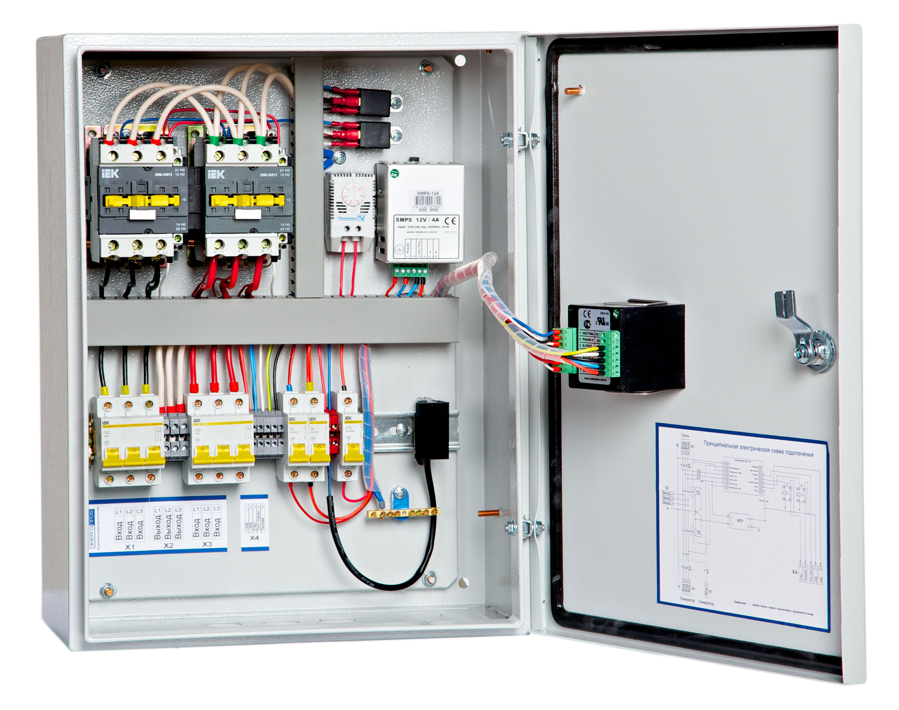

# Шкафы автоматического ввода резерва (АВР)

Панель автоматического ввода резерва (АВР) предназначена для автоматического переключения на резервное питание различных приборов и цепей при исчезновении напряжения с основного ввода.

