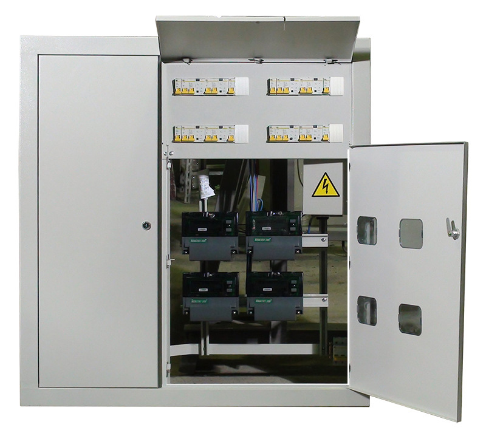
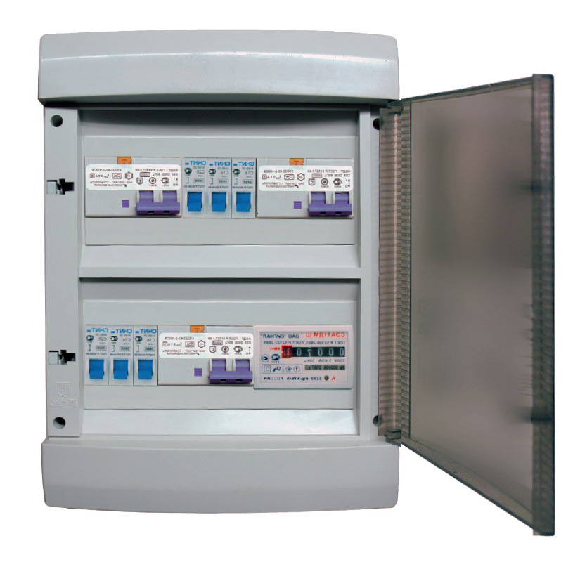

# Щиты для жилых домов (ЩЭ, ЩК, ГРЩД)

## Главный распределительный щит для жилых домов (ГРЩД)

Главный распределительный щит для жилых домов предназначен для приема и распределения электрической энергии напряжением 380/220В трехфазного переменного тока частотой 50 Гц в сетях с глухозаземленной нейтралью, а также для защиты от перегрузок и токов короткого замыкания отходящих линий. Устанавливается в жилых домах повышенной этажности.

(фото можно взять из ГРЩ)

## Щит этажный (ЩЭ)

Щит этажный предназначен для приема, распределения и учета электрической энергии напряжением 380/220В трехфазного переменного тока частотой 50 Гц в сетях с глухозаземленной нейтралью, для защиты линий при перегрузках и коротких замыканиях, а также для нечастых оперативных включений и отключений.

## Щит квартирный, для коттеджа (ЩК)

Щиток квартирный устанавливаются на стене и запитываются в зависимости от электрической схемы от щитов осветительных или распределительных. Щитки монтируются открыто на стене, закрыто на стене или в нише.

