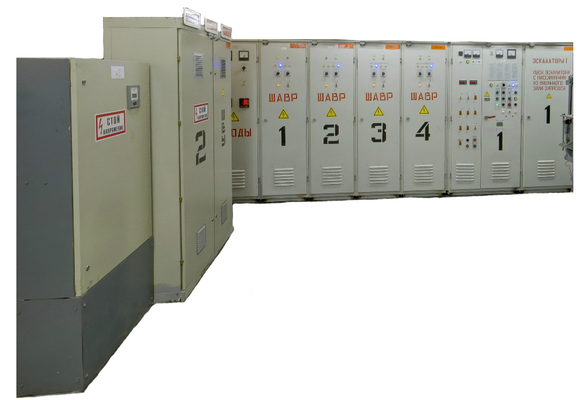

# Щиты для метрополитена

- Распределительные устройства РУНН
- Щит Щ380/220
- ЩАОТ
- ШУРО
- ШУРО-2
- ПЯ
- Шкаф АВР трехфазный
- ШАВР - 45
- КММ
- ЯММ
- ЩСО
- ШУН
- Шкаф ЭМЧ -3
- Шкафы постоянного тока Щ-150/110В
- Щиты автоматики
- Щиты сигнализации
- ЯУО

