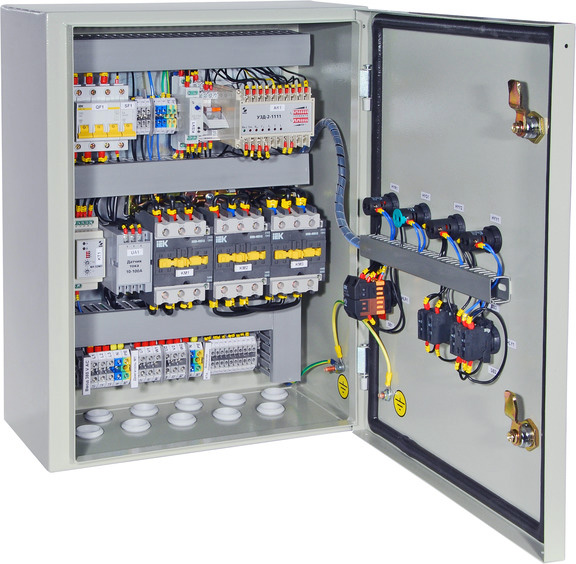

# Щит управления (ЩУ)

Щит управления - устройство, предназначенное для контроля технологических процессов различного характера, а также выработки по заранее заданному алгоритму управляющих сигналов, для корректировки контролируемого процесса.

