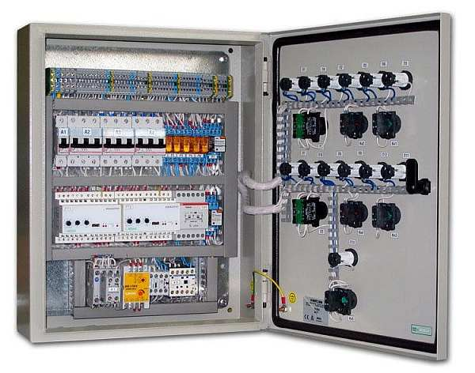

# Щит вентиляции

Щит вентиляции используется для обеспечения контроля над работой системы вентиляции различного назначения. С его помощью можно дистанционно в автоматическом режиме изменять параметры работы нагревателей, вентиляторов, заслонок и других элементов системы вентиляции. Щит вентиляции может управлять практически любыми типами систем: с рециркуляцией, с водяным или электрическим калорифером, с рекуперацией воздуха

